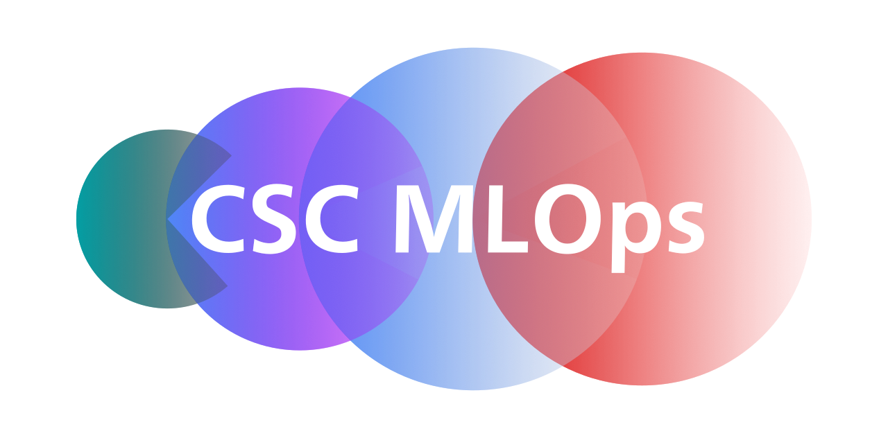

<!-- PROJECT HEADING -->
<br />
<p align="center">
<a href="https://github.com/GSTT-CSC/Project_template">
    
  </a>
<p align="center">
A continuous integration and deployment framework for healthcare AI projects
<br />
<a href="https://pypi.org/project/csc-mlops/"><strong>View on PyPI »</strong></a>
<br />
<br />
<a href="https://github.com/GSTT-CSC/MLOps">View repo</a>
·
<a href="https://github.com/GSTT-CSC/MLOps/issues">Report Bug</a>
·
<a href="https://github.com/GSTT-CSC/MLOps/issues">Request Feature</a>
</p>
<p align="center">
  
  
</p>


## Overview
This project aims to build an effective MLOps framework for the development of AI models in a healthcare setting. The application development framework has three major components:
#### 1. MLOps server
The MLOps server hosts the ML lifecycle management services. An MLFlow instance serves as the management platform, providing experiment tracking and model serving.
#### 2. Project Template
The [project template](https://github.com/GSTT-csc/Project_template) is the starting point for any project using this development framework. This template is flexible enough for any projects and facilitates communication with other parts of the development framework. The figure below illustrates a high level overview of the template and supporting components provided by the MLOps server.


#### 3. csc-mlops package
The csc-mlops python package is available on [PyPI](https://pypi.org/project/csc-mlops) and installed by default by the [project template](https://github.com/GSTT-csc/Project_template). This package handles communication between the project and the server, performs automated tasks, and includes helper functions and classes to streamline development. 

These components work together to simplify and automate many of the processes required for controlled app development. A high level schematic of the framework is illustrated below. In this case XNAT is used as a data archive platform, the framework can be adapted to use other data stores.

> This repository contains the source code for the server and csc-mlops components of the development framework. For further details on the project template component see the [project template repository](https://github.com/GSTT-csc/Project_template).

## Guiding Principles
This is an open source project and all contributions are welcome. Please see the [contribution guidelines](#Contributing).


## The MLOps server
### Server components

* [MLFlow](https://mlflow.org/) Open source platform to manage the ML lifecycle
* [MINIO](https://min.io/) High performance object storage suite
* [NGINX](https://www.nginx.com/) Reverse proxy server

It's not essential to have a complete understanding of all of these, but a high-level understanding of [MLFlow](https://mlflow.org/) in particular will be useful!


<!-- GETTING STARTED  -->
### Getting Started

The production version of this project is intended to run on a dedicated remote machine on an isolated network. This documentation will often describe the MLOps server, development machine and runner as separate machines, but there is no reason these cannot be the same machine if the network locations point to the localhost.

### Prerequisites
First follow the instructions to install [Docker](https://docs.docker.com/engine/install/) and [docker-compose](https://docs.docker.com/compose/install/).

Check docker and docker-compose are working by calling passing the help argument on the command line. If the help information is not returned, or an error is given, revisit the docker installation docs.
```sh
docker --help
docker-compose --help
```

### Setting up the MLOps server
1. Clone and enter the repository
   ```sh
   git clone https://github.com/GSTT-CSC/MLOps.git
   cd MLOps
   ```
   
2. The server should be configured by creating an environment file at ```/mlflow_server/.env```. The environment variable shown are given as an example, and should not be used for a production deployment.

Setting these variables is a requirement, the server will fail to start if they are undefined.

**Please do not use shown values. Consider Writing you own usernames and passwords.**

```shell
# Example env file - fill all required values before using
AWS_ACCESS_KEY_ID=minioUsername
AWS_SECRET_ACCESS_KEY=minioPassword
MLFLOW_S3_IGNORE_TLS=true
POSTGRES_USER=use
POSTGRES_PASSWORD=pass
POSTGRES_DB=db
```

3. Navigate to the mlflow_server directory and start the service. Any docker images that are not present on your local system will be pulled from dockerhub (which might take a while).
 
```shell
 cd mlflow_server
 docker-compose up -d --build
 ```

4. To enable access to the minio artifact storage the host machine needs to be authenticated. Any of the methods supported by boto3 should be compatible, the recommended authentication method is to create an [aws credentials file](https://docs.aws.amazon.com/cli/latest/userguide/cli-configure-files.html). e.g. for ubuntu/linux

```
[default]
AWS_ACCESS_KEY_ID=minioUsername
AWS_SECRET_ACCESS_KEY=minioPassword
```

Upon a successful build the server should now be up and running locally. By default, the mlflow user interface can be accessed at ```http:/localhost:85``` and minio can be accessed at ```https:/localhost:8002```.

To check if the server is up and running successfully running ```docker ps``` in the terminal lists the running containers, and we should see something like:

```angular2html
CONTAINER ID   IMAGE                                      COMMAND                  CREATED             STATUS                       PORTS                                        NAMES
3d51a7580b6f   mlflow_nginx                               "nginx -g 'daemon of…"   About an hour ago   Up About an hour             0.0.0.0:80->80/tcp, 0.0.0.0:8002->8002/tcp   mlflow_nginx
1baa8ff12814   mlflow_app                                 "mlflow server --bac…"   About an hour ago   Up About an hour             5000/tcp                                     mlflow_server
a397b4149c5f   minio/minio:RELEASE.2021-03-17T02-33-02Z   "/usr/bin/docker-ent…"   About an hour ago   Up About an hour (healthy)   9000/tcp, 9002/tcp                           mlflow_server_s3_1
65374369fe4d   postgres:13.1                              "/docker-entrypoint.…"   About an hour ago   Up About an hour (healthy)   5432/tcp,                                    mlflow_db
```

### Server components overview
When we ran ```docker-compose up``` we started 4 networked containers, each of which serves a purpose within the MLOps framework.
1. **NGINX**: The nginx container acts as a reverse proxy to control network traffic.
2. **MLflow**: The MLflow container hosts our MLflow server instance. This server is responsible for tracking and logging the MLOps events sent to it.
3. **MINIO**: The MINIO container hosts our MINIO server. Here we are using MINIO as a self hosted S3 storage location. The MLflow container interfaces well with S3 storage locations for logging artifacts (models, images, plots etc)
4. **postgres**: The database server container is visible only to the MLflow container, which logs MLflow entities to the postgres database hosted on this container. MLFlow entities should not be confused with artifacts (stored on MINIO), and are simple values such as metrics, parameters and configuration options which can be efficiently stored in a database.

There are two [bridge networks](https://docs.docker.com/network/bridge/) which connect these containers, named 'frontend' and 'backend'. The backend is used for communication between containers and is not accessible from the host (or remote), the frontend is accesible from the host (or remote) through the NGINX reverse proxy. NGINX will act as our gatekeeper and all requests will pass through it. This enables us to take advantage of NGINX load balancing and authentication in production versions.

### Experiment tracking with MLflow
MLflow is a framework for managing the full lifecycle of AI models. It contains tools to cover each stage of AI model lifecycle it contains 4 major component Tracking, Projects, Models, and a Model Registry. The endpoint for these tools is an MLflow server that cun run on local or remote hardware and handles all aspects of the lifecycle.

Currently, we will focus primarily on the tracking and projects components.

* Tracking refers to tools used to track experiments to record and compare parameters and results. This is done by adding logging snippets to the ML code to record things like hyper-parameters, metrics and artifacts. These entities are then associated with a particular run with a specific git commit. This git commit points to a specific version of the project files. This means that by using MLflow tracking we are able to identifiy the code used to train an AI model and make comparisons following changes to code structure and hyperparameter choices.

* MLflow uses projects to encapsulate AI tools in a reusable and reproducible way, based primarily on conventions. It also enables us to chain together project workflows meaning we are able to automate a great deal of the model development process.


## csc-mlops package

The csc-mlops package can be installed using pip:
```angular2html
pip install csc-mlops
```
### Experiment 
The `Experiment` class is the primary interface between the developers project code and the MLOps  processes. By using `Experiment` a number of important processes are automated:
- Project configuration and registration
- Communication with the MLOps server
- Ensures all project code is committed and current with repository
- Docker image built if it can't be found locally
- Project logger configured

To use the Experiment class the project must be run using a syntax such as:

```python
from mlops.Experiment import Experiment

config_path = 'config/config.cfg'

exp = Experiment(config_path=config_path)
exp.run(docker_args={}, entry_point='main')
```

> When using the [project template](https://github.com/GSTT-csc/Project_template) this process is performed when executing the `run_project.py` script.

> For more information on how to define the project configuration using a config.cfg file see the [project template](https://github.com/GSTT-csc/Project_template) documentation


<!-- Additional tools -->
## Additional Tools
Additional tools designed to be used with MLOps are located in the [tools](tools) folder.

- [Data toolkit](tools/datatoolkit)
  - Tools for collecting information about large data stores. 


<!-- ROADMAP -->
## Roadmap
See the [open issues](https://github.com/GSTT-CSC/MLOps/issues) for a list of proposed features (and known issues).

<!-- CONTRIBUTING -->
## Contributing
1. Fork or clone the Project
2. Since all code changes are staged on the `develop` branch before releases you will need to checkout this branch first (`git checkout -b develop`)
3. Create your Feature Branch off of `develop` (`git checkout -b feature/AmazingFeature`)
4. Commit your Changes (`git commit -m 'Add some AmazingFeature'`)
5. Push to the remote (`git push origin feature/AmazingFeature`)
6. Open a Pull Request and specify that you want to merge your feature branch into the `develop` branch

### Testing
When contributing, you are _strongly_ encouraged to write tests for any functions or classes you add. Please uses pytest and add your tests to an appropriate location in the  `tests` directory, which also contains some examples to get you started.

<!-- Warning! -->
## Warning!
Please be aware of unsafe deserialisation when utilising MLFlow, do not download models from publically hosted MLFlow instances and then load them locally as this can allow potentially malicious code to be run on your machine.

https://github.com/advisories/GHSA-cwgg-w6mp-w9hg

<!-- ACKNOWLEDGEMENTS -->
## Acknowledgements

* [README template by othneildrew](https://github.com/othneildrew/Best-README-Template)


<!-- MARKDOWN LINKS & IMAGES -->
<!-- https://www.markdownguide.org/basic-syntax/#reference-style-links -->
[contributors-shield]: https://img.shields.io/github/contributors/github_username/repo.svg?style=for-the-badge
[contributors-url]: https://github.com/github_username/repo/graphs/contributors
[forks-shield]: https://img.shields.io/github/forks/github_username/repo.svg?style=for-the-badge
[forks-url]: https://github.com/github_username/repo/network/members
[stars-shield]: https://img.shields.io/github/stars/github_username/repo.svg?style=for-the-badge
[stars-url]: https://github.com/github_username/repo/stargazers
[issues-shield]: https://img.shields.io/github/issues/github_username/repo.svg?style=for-the-badge
[issues-url]: https://github.com/github_username/repo/issues
[license-shield]: https://img.shields.io/github/license/github_username/repo.svg?style=for-the-badge
[license-url]: https://github.com/github_username/repo/blob/master/LICENSE.txt
[linkedin-shield]: https://img.shields.io/badge/-LinkedIn-black.svg?style=for-the-badge&logo=linkedin&colorB=555
[linkedin-url]: https://linkedin.com/in/github_username
